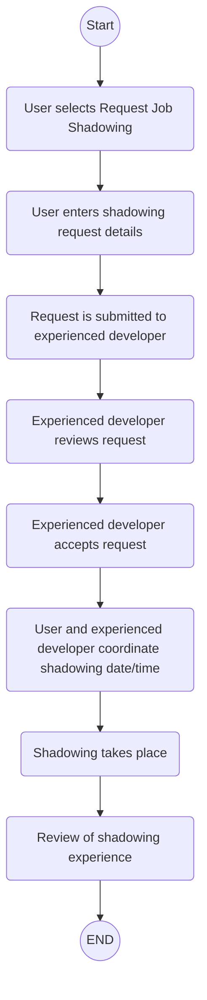
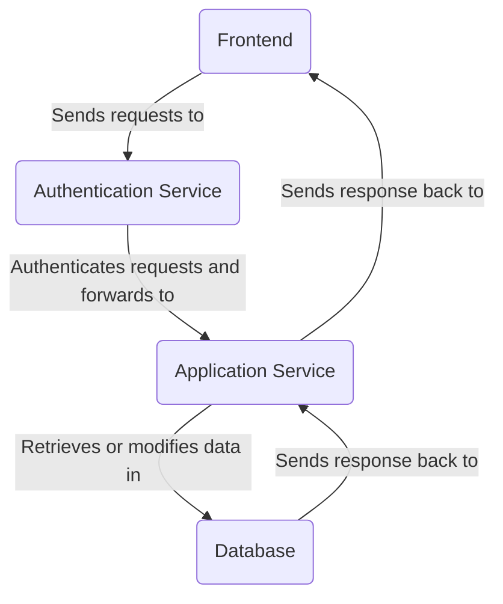

# User Story

```mermaid
graph 
A((Start)) --> B(User selects Request Job Shadowing)
B --> C(User enters shadowing request details)
C --> D(Request is submitted to experienced developer)
D --> E(Experienced developer reviews request)
E --> F(Experienced developer accepts request)
F --> G(User and experienced developer coordinate shadowing date/time)
G --> H(Shadowing takes place)
H --> I(Review of shadowing experience)
I --> J((END))
```

<!-- header -->
# Architecture

```mermaid
graph 
A(Frontend) -- Sends requests to --> B(Authentication Service)
B -- Authenticates requests and forwards to --> C(Application Service)
C -- Retrieves or modifies data in --> D(Database)
D -- Sends response back to --> C
C -- Sends response back to --> A


```